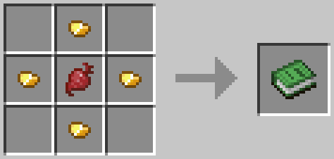
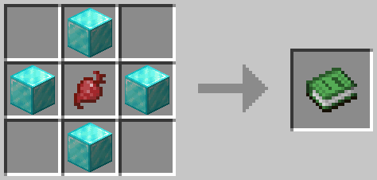
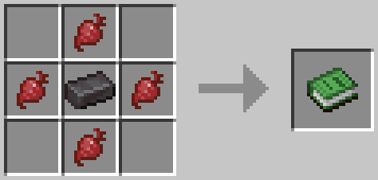

# Death Curse

[Downloads](https://github.com/antD97/DeathCurse/releases) |
[Planet Minecraft](https://www.planetminecraft.com/data-pack/death-curse/)

Gone are the days of resurrecting for free. Don't you know bringing someone back to life
comes with a price? It's about time you learn. For every subsequent life you live, you will find
life to be increasingly *unstable*. Enjoy.

Death Curse is a Minecraft datapack that applies a curse to players that respawn. For every respawn,
the curse worsens. Some of the features require particles to be enabled so be sure to turn them on!
I've made the in-game guide book intentionally vague so that you can have fun learning the
mechanics. If you'd like more details, see below.

There is also a complimentary resource pack for the datapack. It is not required, but it improves
the experience by adding textures for custom items and adds one unique sound effect.

## Building

This project uses special syntax from
[Shorthand Commands](https://github.com/antD97/ShorthandCommands). To build from this project from
source:

1. Download Shorthand Commands v1.0
2. Copy `header.txt` to the Shorthand Commands directory
3. Set `project` in the `shorthand.conf` file to this project's directory
4. Run `run.bat`

# Curse Levels

## Death Curse I
Description: **nausea**  
Effects:
- **every 45s(±5s): 4s nausea**
- **every 2m(±10s): 5s nausea**

## Death Curse II
Description: nausea, **fatigue**  
Effects:
- **-1 max hp**
- every 45s(±5s): 4s nausea
- every 2m(±10s):
  - **50%: 5s nausea**
  - **50%: 6s nausea, 5s mining fatigue, & 5s slowness**

## Death Curse III
Description: nausea, fatigue, **curse leak**  
Effects:
- -1 max hp
- every 45s(±5s): 4s nausea
- every 2m(±10s):
  - 50%: 5s nausea
  - 50%: 6s nausea, 5s mining fatigue, & 5s slowness
- **every 5m(±20s): 1 hostile mob within 30 blocks of the player will be cloaked for 20m (max 1 at**
  **a time)**

## Death Curse IV
Description: **heavy nausea**, **heavy fatigue**, curse leak  
Effects:
- **-2 max hp**
- **every 30s(±5s):** 4s nausea
- **every 1m40s(±10s):**
  - 50%: 5s nausea
  - 50%: 6s nausea, **5s weakness**, 5s **mining fatigue II**, & 5s slowness
- every 5m(±20s): 1 hostile mob within 30 blocks of the player will be cloaked for 20m (max 1 at a
  time)

## Death Curse V
Description: heavy nausea, heavy fatigue, curse leak, **poison**  
Effects:
- -2 max hp
- every 30s(±5s): 4s nausea
- every 1m40s(±10s):
  - 50%: 5s nausea
  - 50%: 6s nausea, 5s weakness, 5s mining fatigue II, & 5s slowness
- **every 3m(±15s):**
  - **75%: 2s poison (1/2♥)**
  - **25%: 3s poison (1♥)**
  - **poison will only decrease health to 3♥ at most**
- every 5m(±20s): 1 hostile mob within 30 blocks of the player will be cloaked for 20m (max 1 at a
  time)

## Death Curse VI
Description: heavy nausea, heavy fatigue, **heavy curse leak**, poison  
Effects:
- **-3 max hp**
- every 30s(±5s): 4s nausea
- every 1m40s(±10s):
  - 50%: 5s nausea
  - 50%: 6s nausea, 5s weakness, 5s mining fatigue II, & 5s slowness
- every 3m(±15s):
  - 75%: 2s poison (1/2♥)
  - 25%: 3s poison (1♥)
  - poison will only decrease health to 3♥ at most
- every 5m(±20s): 1 hostile mob within 30 blocks of the player will be cloaked **and silenced** for
  20m **(max 3 at a time)**

## Death Curse VII
Description: heavy nausea, **intense fatigue**, heavy curse leak, poison  
Effects:
- -3 max hp
- every 30s(±5s): 4s nausea
- every 1m40s(±10s):
  - 50%: 5s nausea
  - **25%:** 6s nausea, 5s weakness, 5s mining fatigue II, & 5s slowness
  - **25%: 7s nausea, 5s weakness, 5s mining fatigue II, 5s slowness II, 3s blindness, & +10s**
    **hunger X (~1.5🍗) (hunger is not applied if current food is 3🍗 or less)**
- every 3m(±15s):
  - 75%: 2s poison (1/2♥)
  - 25%: 3s poison (1♥)
  - poison will only decrease health to 3♥ at most
- every 5m(±20s): 1 hostile mob within 30 blocks of the player will be cloaked and silenced for 20m
  (max 3 at a time)

## Death Curse VIII
Description: heavy nausea, intense fatigue, heavy curse leak, **heavy poison**  
Effects:
- **-4 max hp**
- every 30s(±5s): 4s nausea
- every 1m40s(±10s):
  - 50%: 5s nausea
  - 25%: 6s nausea, 5s weakness, 5s mining fatigue II, & 5s slowness
  - 25%: 7s nausea, 5s weakness, 5s mining fatigue II, 5s slowness II, 3s blindness, & 10s hunger X
    (~1.5🍗) (hunger is not applied if current food is 3🍗 or less)
- every 3m(±15s):
  - **75%: 3s poison (1♥)**
  - **25%: 4s poison (1 1/2♥)**
  - **poison will only decrease health to 2 1/2♥ at most**
- every 5m(±20s): 1 hostile mob within 30 blocks of the player will be cloaked and silenced for 20m
  (max 3 at a time)

## Death Curse XI
Description: heavy nausea, intense fatigue, heavy curse leak, heavy poison, **mob aggression**  
Effects:
- -4 max hp
- every 30s(±5s): 4s nausea
- every 1m40s(±10s):
  - 50%: 5s nausea
  - 25%: 6s nausea, 5s weakness, 5s mining fatigue II, & 5s slowness
  - 25%: 7s nausea, 5s weakness, 5s mining fatigue II, 5s slowness II, 3s blindness, & 10s hunger X
    (~1.5🍗) (hunger is not applied if current food is 3🍗 or less)
- every 3m(±15s):
  - 75%: 3s poison (1♥)
  - 25%: 4s poison (1 1/2♥)
  - poison will only decrease health to 2 1/2♥ at most
- every 5m(±20s):
  - 1 hostile mob within 30 blocks of the player will be cloaked and silenced for 20m (max 3 at a time)
  - **for 1m: hostile mobs within 5 blocks of the player are buffed with 5s regeneration, 5s fire**
    **resist, & 5s speed**

## Death Curse X+
Description: heavy nausea, intense fatigue, heavy curse leak, heavy poison, mob aggression, **fear**  
Effects:
- **-5 max hp**
- every 30s(±5s): 4s nausea
- every 1m40s(±10s):
  - 50%: 5s nausea
  - 25%: 6s nausea, 5s weakness, 5s mining fatigue II, & 5s slowness
  - 25%: 7s nausea, 5s weakness, 5s mining fatigue II, 5s slowness II, 3s blindness, & 10s hunger X
    (~1.5🍗) (hunger is not applied if current food is 3🍗 or less)
- every 3m(±15s):
  - 75%: 3s poison (1♥)
  - 25%: 4s poison (1 1/2♥)
  - poison will only decrease health to 2 1/2♥ at most
- every 5m(±20s):
  - 1 hostile mob within 30 blocks of the player will be cloaked and silenced for 20m (max 3 at a
    time)
  - for 1m: hostile mobs within 5 blocks of the player are buffed with 5s regeneration, 5s fire
    resist, & 5s speed
- **3+ hostile mobs within 5 blocks: 5s slowness, 5s blindness, & 5s weakness**

# Curse Relief

## Curse Cookies

There are three curse cookie tiers: Curse Cookie I, Curse Cookie II, and Curse Cookie III. To craft
a Curse Cookie I, use the recipe above.

To create a Curse Cookie II, throw four or more Curse Cookie I in a group on the ground. After 10-20
seconds, for every four Curse Cookie I a new Curse Cookie II will be created and the four Curse
Cookie I used to create it will be destroyed. The curse cookies must be together as a single item
stack entity for the merge to work. Curse Cookie III can be created in the same way, but instead
requires four Curse Cookie II to create one.

Eating a curse cookie will reduce the player's curse level for 30 minutes. The amount of levels
reduced is as follows:

- Curse Cookie I: -1 curse level
- Curse Cookie II: -3 curse levels
- Curse Cookie III: -11 curse levels

Players cannot eat more curse cookies to achieve higher amounts of curse reduction. If a player eats
a curse cookie multiple times within the 30 minutes of its effect, the effect timer is only reset
each time. If a player eats a higher tier curse cookie while under the effect of a lower tier curse
cookie, the reduction effect is replaced by the higher tier curse cookie and the effect timer is
reset.

## Curse Wards

There are three curse ward tiers: Curse Ward I, Curse Ward II, and Curse Ward III. To craft a Curse
Ward I, use the recipe above. Curse wards don't despawn after being on the ground for five minutes
and are immune to fire and lava but are *not* immune to explosions.

Creating higher tiers of curse wards is similar to creating higher tiers of curse cookies, but the
thrown items will only be used to create a new curse ward if they are on fire. If there are four or
more curse ward thrown items that are on fire within one block of each other, after 10-20 seconds,
they will be destroyed and a new higher tier curse ward will be created.

Curse wards will reduce a player's curse level simply by being anywhere inside a player's inventory.
The amount of levels reduced is as follows:

- Curse Ward I: -1 curse level
- Curse Ward II: -3 curse levels
- Curse Ward III: -11 curse levels

Having multiple curse wards in a player's inventory stacks the wards' curse level reduction effects.
For example, if a player had two Curse Ward I and one Curse Ward II in their inventory, they would
have a total of 5 levels of curse reduction.

## Resurrection Abominations

There are three resurrection abominations tiers: Resurrection Abomination I, Resurrection
Abomination II, and Resurrection Abomination III. To craft a Resurrection Abomination I, use the
recipe above. Resurrection abomination don't despawn after being on the ground for five minutes and
are immune to fire and lava but are *not* immune to explosions.

Creating higher tiers of resurrection abominations is identical to curse wards, but have an
additional requirement of being formed in the Nether.

Resurrection abominations are used to start a resurrection ritual that, once complete, will
permanently reduce a player's death count. The amount of deaths reduced is as follows:

- Resurrection Abomination I: -1 death
- Resurrection Abomination II: -3 deaths
- Resurrection Abomination III: -11 deaths

To begin a resurrection ritual, a player must eat a resurrection abomination. As long as there is a
player who is taking part in a resurrection ritual it will continue to rain and no player will be
able to sleep. The resurrection ritual is completed at midnight where a short event will take place.
If a player taking part in a ritual is underneath any blocks, is not in the overworld, or is dead at
midnight, the ritual will fail and the resurrection abomination is lost. At the end of the event,
the player will be struck with lightning until dead and will respawn with the death reduction
applied. It is likely that the lightning will destroy any items in the player's inventory, so it is
recommended to empty your inventory before the final resurrection event.

Players cannot eat more resurrection abominations before the ritual has completed to achieve higher
amounts of curse reduction. If a player eats another resurrection abomination before the
resurrection event, reduction amount will only overwrite the previous resurrection abomination
effect if the resurrection abomination is a higher tier, otherwise the item is wasted.

# Player Triggers

`/trigger death_curse_level`  
Tells the player their current death count and curse level.

`/trigger death_curse_intro`  
Resends the Death Curse introductory message.

`/trigger death_curse_book`  
Gives the player another copy of the Death Curse guide book.

# Operator Functions

`/function death_curse:op/clear_all`  
Removes all scoreboard objectives, scheduled functions, and entities with custom tags. The next time
the datapack is reloaded, the datapack will run like it did the first time.

`/function death_curse:op/disable_for_player`  
Used to disable the Death Curse for a specific player.

`/function death_curse:op/enable_for_player`  
Used to enable the Death Curse for a specific player (default enabled for everyone).

---
Copyright © 2022 antD97  
Licensed under the [MIT License](LICENSE)
